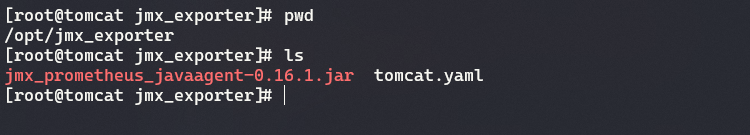

# JMX exporter for Tomcat server monitoring

## Ojective

In order for Tomcat server to be monitered by prometheus a java agent 
need to be installed. java agent will intercept Tomcat server 
and expose the metrics via configured port for prometheus to scrape.
An extra config need to be added to catalina.sh file and 
custom java agent for this to work.

## Goal

Java agent is installed and metrix is exposed on designated port
to be scraped by prometheus.

## 1. Create directory to place java agent and config file.

### Create directory for java agent, in this case it is placed on /opt path
```bash
mkdir /opt/jmx_exporter
```

### Download the latest java agent JMX_Eporter to newly created path

[Github page]("https://github.com/prometheus/jmx_exporter") In case the link inaccessible

```bash
wget https://repo1.maven.org/maven2/io/prometheus/jmx/jmx_prometheus_javaagent/0.16.1/jmx_prometheus_javaagent-0.16.1.jar
```

### Copy and paste the follow config in tomcat.yml file

```bash
---   
lowercaseOutputLabelNames: true
lowercaseOutputName: true
whitelistObjectNames: ["java.lang:type=OperatingSystem", "Catalina:*"]
blacklistObjectNames: []
rules:
  - pattern: 'Catalina<type=Server><>serverInfo: (.+)'
    name: tomcat_serverinfo
    value: 1
    labels:
      serverInfo: "$1"
    type: COUNTER
  - pattern: 'Catalina<type=GlobalRequestProcessor, name=\"(\w+-\w+)-(\d+)\"><>(\w+):'
    name: tomcat_$3_total
    labels:
      port: "$2"
      protocol: "$1"
    help: Tomcat global $3
    type: COUNTER
  - pattern: 'Catalina<j2eeType=Servlet, WebModule=//([-a-zA-Z0-9+&@#/%?=~_|!:.,;]*[-a-zA-Z0-9+&@#/%=~_|]), name=([-a-zA-Z0-9+/$%~_-|!.]*), J2EEApplication=none, J2EEServer=none><>(requestCount|processingTime|errorCount):'
    name: tomcat_servlet_$3_total
    labels:
      module: "$1"
      servlet: "$2"
    help: Tomcat servlet $3 total
    type: COUNTER
  - pattern: 'Catalina<type=ThreadPool, name="(\w+-\w+)-(\d+)"><>(currentThreadCount|currentThreadsBusy|keepAliveCount|connectionCount|acceptCount|acceptorThreadCount|pollerThreadCount|maxThreads|minSpareThreads):'
    name: tomcat_threadpool_$3
    labels:
      port: "$2"
      protocol: "$1"
    help: Tomcat threadpool $3
    type: GAUGE
  - pattern: 'Catalina<type=Manager, host=([-a-zA-Z0-9+&@#/%?=~_|!:.,;]*[-a-zA-Z0-9+&@#/%=~_|]), context=([-a-zA-Z0-9+/$%~_-|!.]*)><>(processingTime|sessionCounter|rejectedSessions|expiredSessions):'
    name: tomcat_session_$3_total
    labels:
      context: "$2"
      host: "$1"
    help: Tomcat session $3 total
    type: COUNTER   
```

### Make sure both of this file is present in the directory.




### Set necessary permission to the config file and java agent.
```bash
chown -R tomcat:tomcat ./jmx_exporter
```


## 2. Edit Tomcat configuration file and append additional environment variable for JMX Exporter 

### Best practice is not to edit the catalina.sh file directly, please create  and put additional config in setenv.sh file and apply necessary permission so that it can be executed.

### Tomcat installation path depends on how it is installed initially. In this case the path will be at /opt/tomcat/bin


### Create setenv.sh

```bash
touch setenv.sh
```

### Add this line to the setenv.sh file

```bash
JAVA_OPTS="-javaagent:/opt/jmx_exporter/jmx_prometheus_javaagent-0.16.1.jar=20000:/opt/jmx_exporter/tomcat.yaml"
```

### Set necessary permission and make it executeable.

```bash
chown tomcat:tomcat setenv.sh
chmod +x setenv.sh
```

### ENV Variable explaination

```bash
-javaagent:/opt/jmx_exporter/jmx_prometheus_javaagent-0.16.1.jar - Absolute Path to the java agent
=20000 - Number of port that the metrics will be exposed
:/opt/jmx_exporter/tomcat.yaml -  Config file that will be loaded by java agent
```

### Restart Tomcat server for the configuration to take effect.

```bash
systemctl restart tomcat
```

## 3. If there is no error after restarting the Tomcat Server java agent installation is successful. 

### Check port binding to java process. it will display port 20000 in listening state.


```bash
ss -tlpn
```

### Access the web interface with ip address and port. Please discuss with firewall team to allow access.


### Rollback 
```bash
Just comment out the config inside setenv.sh or completely remove it.
systemctl restart tomcat
afterward.
```

###### Document prepared by Fauzuwan Bin Nazri


